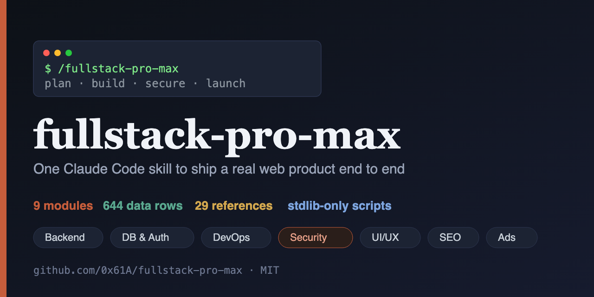
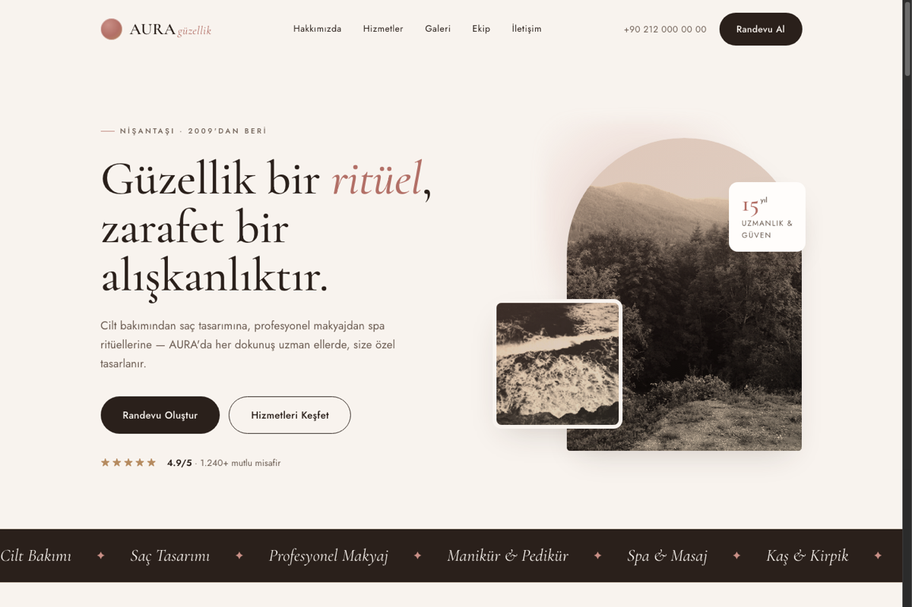
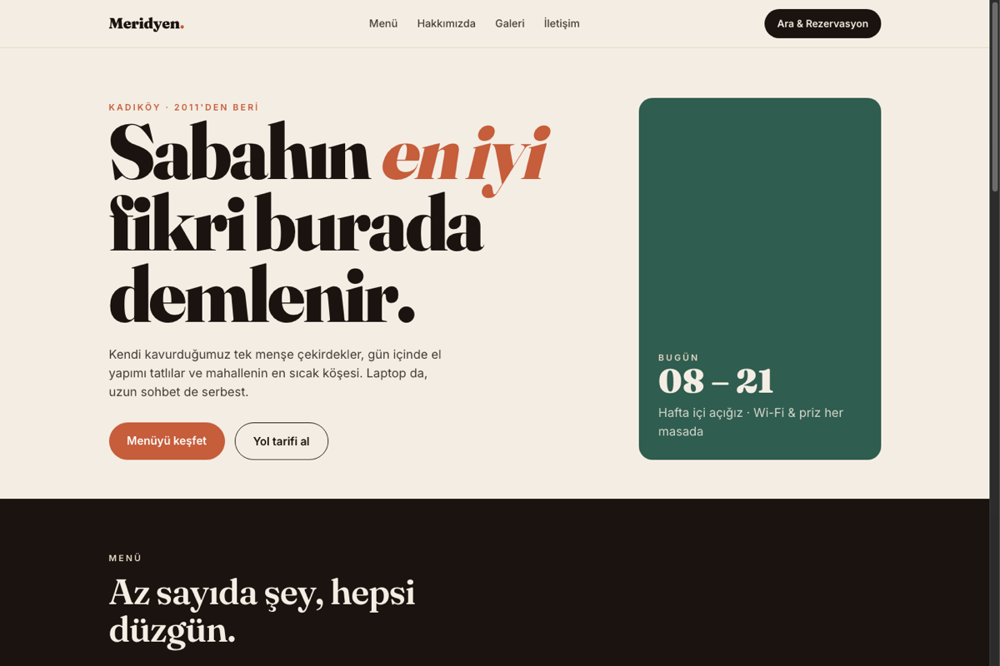

# fullstack-pro-max

[](https://github.com/0x61A/fullstack-pro-max/actions/workflows/validate.yml)
[](https://github.com/0x61A/fullstack-pro-max/releases)
[](LICENSE)
[](#requirements)

*Türkçe sürüm: [README.tr.md](BENİ-OKU.md)*

**One [Claude Code](https://claude.com/claude-code) skill that ships a real web product end to end** — distinctive UI/UX, backend architecture, database & auth, deployment, testing, cybersecurity, SEO, ads, e-commerce payments, AI features, analytics, email, and i18n — with adaptive stack selection instead of one fixed frontend+backend combo. Built for two use cases: agency/client delivery and personal SaaS builds.

<p align="center">
  
</p>

## Contents

[What's inside](#whats-inside) · [Quick start](#quick-start) · [In use](#what-it-looks-like-in-use) · [Field tests](#field-tests) · [Real builds](#real-builds) · [Scripts](#scripts) · [Known limitations](#known-limitations)

## Quick start

```bash
git clone https://github.com/0x61A/fullstack-pro-max.git ~/.claude/skills/fullstack-pro-max
```

Start a new Claude Code session — the skill loads automatically from `SKILL.md`'s frontmatter. Invoke it directly with `/fullstack-pro-max <request>`, or just describe the task ("plan a SaaS backend," "audit this before launch," "make this landing page look less generic") and let it trigger on its own.

**Requirements:** Claude Code (CLI/desktop/web/IDE) and Python 3 for the helper scripts — standard library only, nothing to `pip install`. Several modules can optionally use connected MCP tooling (Supabase, Vercel, Netlify, Cloudflare, Shopify) for live operations; the guidance still works without them, and the skill says so explicitly when a connector would help.

## What's inside

Thirteen modules, each backed by structured data (CSV), on-demand reference docs, and stdlib-only Python scripts. ~1038 data rows, 37 reference docs, 16 scripts — **zero vendored dependencies**, no bundled venv, no `requirements.txt`.

**Ship the product**

| Module | Coverage |
|---|---|
| **Backend & API** | Adaptive stack selection (Next.js/Express/Nest.js/Fastify · FastAPI/Django · Supabase/Firebase · Cloudflare Workers), API design, error handling |
| **Database & Auth** | Schema design, RLS/multi-tenancy, auth strategy matrix, migration safety |
| **UI/UX & Distinctive Frontend** | Anti-generic-AI-design playbook — 30-style aesthetic vocabulary (brutalism → gradient-mesh), brand-personality-axes → Design DNA derivation, layout/type/motion techniques. Turns example site URLs into a Reference Design Brief before coding; a 90-entry known-sites library suggests real named sites (+ gallery-search fallbacks) per style when there's no link to start from; a 24-entry component-library index (21st.dev, shadcn/ui, Aceternity UI, Magic UI, Tremor, and more) plus a copy-paste/CLI/npm integration guide for when the ask is a ready-made component rather than a from-scratch build |
| **E-commerce & Payments** | Stripe + Shopify integration patterns, signature-verified webhook scaffolds |
| **DevOps & Deployment** | CI/CD, Vercel/Netlify/Cloudflare/Railway decision matrix, env & secrets |
| **Testing/QA** | Test strategy by stack, accessibility + Core Web Vitals checklist |
| **Security/Cybersecurity** | 134 checks: OWASP Top 10, STRIDE threat modeling, secure coding per stack, API/infra/supply-chain security, incident response — plus a stdlib static secret/pattern scanner |

**Grow the product**

| Module | Coverage |
|---|---|
| **SEO** | 112 checks: technical, on-page, content/E-E-A-T, schema selection, GEO/AI-citability, local SEO (GBP/NAP/reviews) |
| **Ads** | 74 checks: Google/Meta/LinkedIn/TikTok/Microsoft + cross-platform tracking/attribution + creative/budget discipline |
| **AI Integration** | Claude API: model tier selection & routing, streaming endpoints, tool use, RAG, prompt caching/cost control, evals, 16 LLM-security checks (OWASP LLM Top 10) |
| **Analytics** | GA4/PostHog/Plausible selection, event taxonomy & track-plan-as-code, funnels/retention, consent-compliant measurement |
| **Email** | Resend/Postmark/SES selection, queue-backed idempotent sending, 14 deliverability checks (SPF/DKIM/DMARC, bulk-sender rules, warmup) |
| **i18n / Localization** | next-intl/react-i18next selection, URL strategy, hreflang, RTL, ICU pluralization, 12 l10n checks |

## What it looks like in use

Query any module's data the same way — one shared CSV schema across all 13 modules:

```
$ python3 scripts/common/search.py data/ui-ux/distinctiveness-patterns.csv --query "layout"
id     category                option
-----  ----------------------  ----------------------------------------
UX052  Layout Distinctiveness  Break the vertical-stack-of-centered-sec
UX054  Grid Systems            Use an asymmetric or broken grid deliber
UX059  Typography as Layout    Let display type be a primary layout/com
...
6 match(es).
```

Generators scaffold real, opinionated code — e.g. security headers for Next.js:

```
$ python3 scripts/security/generate.py --stack nextjs --dry-run
const securityHeaders = [
  { key: "Content-Security-Policy",
    // TODO: loosen deliberately per resource you actually need -- start strict.
    value: "default-src 'self'; script-src 'self'; ... frame-ancestors 'none'" },
  { key: "Strict-Transport-Security", value: "max-age=63072000; includeSubDomains; preload" },
  ...
];
```

## Field tests

Two real prompts run end to end through the actual scripts (not dry-runs, not transcripts) — output committed under [`examples/`](examples):

| Scenario | Prompt | Found & fixed |
|---|---|---|
| [`salon-site/`](examples/salon-site) | "Build a from-scratch website for my business" (a local salon, no stated preferences) | `data/backend/stacks.csv` had no row for "no backend needed" — the most common real answer for a brochure-site brief. Added `BE088` + a new question 0 in the Stack Decision Tree. |
| [`dark-technical-dashboard/`](examples/dark-technical-dashboard) | "Dark, technical dashboard — use a ready-made component instead of building from scratch" | A palette row's hex-extraction heuristic silently dropped the accent color; `scripts/backend/generate.py` double-pluralized resource names already given in plural form (`projects` → `projectses`). Both fixed. Two component-library sources were also live-fetched and spot-checked against `component-libraries.csv`'s claims — both still accurate, one detail updated. |

Each folder's `.md` write-up shows the exact commands run and which reference files/CSV rows they hit, so the routing logic can be re-checked against the current version of the skill, not just read about.

## Real builds

The `examples/` scaffolds above are deliberately unfinished — TODO-marked structure, not a shippable page. These are screenshots of what that starting point looks like carried through to a real, finished site.

**AURA — Güzellik & Bakım Evi** (salon/beauty). Same decision path as the [`salon-site` field test](examples/salon-site): `BE088` no-backend call, `UX269` salon sector direction, playful-rounded style.



**Meridyen Kahve** (cafe/restaurant). Built along the `UX068` sector direction: warm earth palette, editorial food photography, asymmetric hero.



## Scripts

Every script supports `--help`.

```bash
# query & validate
python3 scripts/common/search.py data/backend/stacks.csv --query "edge"                    # query any CSV
python3 scripts/common/validate.py                                                          # validate all data CSVs (same check CI runs)
python3 scripts/common/score.py data/security --results results.json                        # severity-weighted posture score

# scaffolders (one per module)
python3 scripts/backend/generate.py posts --stack nextjs-api                                # CRUD endpoint
python3 scripts/security/audit.py ./my-project                                              # static scan for secrets/dangerous patterns
python3 scripts/ai/generate.py --stack nextjs-api --dry-run                                 # streaming Claude chat endpoint
python3 scripts/ui-ux/scan.py https://a.com https://b.com --brief                           # Reference Design Brief draft from example sites
python3 scripts/ui-ux/generate.py --palette UX088 --components hero,nav                     # design tokens + component skeletons

# UI/UX lookup tables
python3 scripts/common/search.py data/ui-ux/known-sites-library.csv --tag style:UX141       # real sites for "dark-technical"
python3 scripts/common/search.py data/ui-ux/component-libraries.csv --category "Selection Guide"  # ready-made component sources
```

## Known limitations

- **Field-tested twice, not yet at scale.** [Two real prompts](#field-tests) have been run end to end through the actual scripts, and both surfaced real bugs that got fixed — but that's two scenarios out of a very large possibility space, and both were run by this skill's author, not an independent user. Treat the routing logic as increasingly-checked, not fully proven, until it's been exercised on more/messier real prompts.
- **Two UI/UX lookup CSVs, written from model knowledge, not fetched live.** `known-sites-library.csv` (visual inspiration) and `component-libraries.csv` (real code sources) were authored from existing knowledge to save tokens, not verified against the live web at write time. Both say so in their own `last_verified` caveats — always confirm specifics (that a site still looks that way, that a component's API hasn't changed) before quoting them as current fact.
- **Guidance, not a guarantee.** The security, payments, SEO, and ads material is a strong starting point — validate it against your own project's context, compliance requirements, and current platform docs before relying on it in production.

## Notes

- **Original content, self-contained.** No runtime dependency on any other skill.
- **CI eats its own dog food.** Every push validates all data rows against the shared schema, smoke-tests every script, checks that internal file references resolve, and scans the repo with the skill's own `scripts/security/audit.py`.

See [`docs/how-it-was-built.md`](docs/how-it-was-built.md) for the architectural decisions behind this skill, and [`CHANGELOG.md`](CHANGELOG.md) for the full version history.

## License

[MIT](LICENSE) © 2026 Ahmet Şerif Kart
